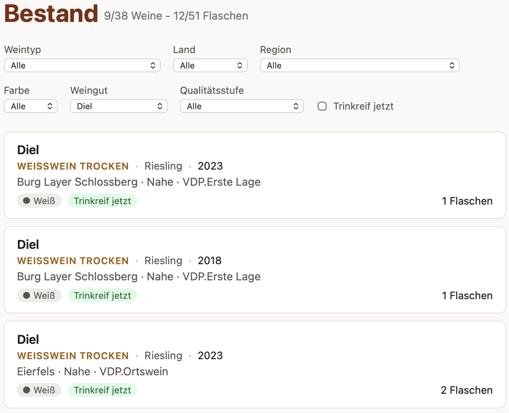

# 🍷 Schwips

Schwips is a personal wine cellar tracker. It keeps a bottle-level inventory of your wine collection, and — its main trick — new bottles get added by **Claude Code reading the label photos**, researching whatever isn't printed on the label, and importing the result straight away, leaving a written record behind in case you want to double-check or correct something afterward.

The UI is in German (the author's language); this README is in English.



## ✨ What it does

- **Inventory, not just a wine list.** A *wine* (producer, vintage, grapes, appellation, ...) is a separate concept from a *bottle* (the physical thing in your cellar). Buy three bottles of the same wine and you get one wine card showing "3 Flaschen" — not three duplicate entries.
- **Photo-driven import.** Drop label photos into `runtime/incoming/`, run `/import-wines` in Claude Code. It groups photos into bottles, reads producer/vintage/grapes/appellation/etc. off the label, researches anything missing (drinking window, grape composition for appellation wines, background on the producer) via web search, checks for duplicates against your existing stock, and imports the batch right away.
- **A written record either way.** Every import run leaves behind a human-readable Markdown file with the source photos embedded, the extracted/researched fields, and an open-questions list flagging anything uncertain — so you can check what got imported and fix it later if something's off. The DB write itself always goes through one validated, transactional CLI command, whether Claude runs it for you or you run it by hand.
- **Provenance-aware data.** Every field on a wine remembers whether it came from the label, from research, or from you — so you can tell a hard fact from a best guess.
- **Drinking windows.** Each wine gets an estimated `drink_from`/`drink_until` window based on its quality tier (Gutswein vs. Erste Lage vs. Großes Gewächs, etc.), and the Bestand view flags wines that are "Trinkreif jetzt" or "Noch nicht trinkreif".
- **Filtering.** Filter your Bestand by wine type, country, region, color, producer, and quality level, and see at a glance how many wines/bottles match.
- **Tasting notes.** Log notes and ratings against individual bottles over time.

## 🧱 Stack

SvelteKit (full-stack, TypeScript) + SQLite via Drizzle ORM. Single-file datastore, no external services required beyond Claude Code itself for the import step.

## 🚀 Installing

```sh
git clone <this-repo>
cd schwips
npm install

# optional but recommended: seed common grape varieties + aliases
# (e.g. so "Pinot Grigio" on a label resolves to Grauburgunder out of the box)
npm run db:seed

# start the dev server
npm run dev
```

The app is now on `localhost` (see the terminal output for the exact port). All runtime data — the SQLite file, imported photos, and the import inbox — lives under `runtime/` and is entirely gitignored, so a fresh clone starts with an empty cellar. You don't need a separate setup step for it: the directory tree and the SQLite schema are created automatically the first time the app (or any script) starts, before anything else runs.

## 🔄 Workflow

### 1. 📸 Drop in photos

Take one or more photos per bottle (front label, back label, capsule — however many you need to capture everything) and copy them into `runtime/incoming/`. No renaming, no fixed count per bottle.

### 2. 🤖 Run the import command

In Claude Code, run:

```
/import-wines
```

Claude reads every photo, groups them into bottles (by filename order, then visually confirmed), extracts what's on the label, and researches anything that isn't there — grape composition for appellation wines like Chianti, typical drinking windows, producer background. It checks your existing stock for a matching wine (by producer, vintage, appellation, grapes, ...) so a second bottle of something you already own just increments stock instead of creating a duplicate.

It then writes a pair of files and imports them right away:

- `runtime/incoming/review/<timestamp>.json` — machine-readable, the exact input the import CLI runs on
- `runtime/incoming/review/<timestamp>.md` — human-readable, with the source photos embedded inline next to each wine, plus an **open questions** list flagging anything uncertain (an unreadable vintage, a researched-not-printed grape blend, and so on)

```sh
npm run import -- runtime/incoming/review/<timestamp>.json
```

This CLI is the *only* thing that ever writes to the database — whether Claude runs it for you or you run it by hand. It validates the JSON, runs the whole batch in one transaction, and — only once that succeeds — moves the photos out of the inbox into `runtime/photos/<wine_id>/`. If anything fails, nothing is written and nothing is moved.

### 3. 👀 Check the record, correct if needed

Skim the `.md` for anything flagged in `open_questions` or that just looks off. Since the data's already imported, fix it in the app directly, or edit the DB and re-run the import for a correction — nothing about wine data is precious enough to need a pre-write approval gate.

### 4. 🍾 Browse your Bestand

Open the app. Filter, check what's ready to drink, log a tasting note when you open a bottle, mark it consumed.

## 🛠 Useful commands

| Command | What it does |
|---|---|
| `npm run dev` | Start the dev server |
| `npm run db:generate` | Generate a Drizzle migration from schema changes |
| `npm run db:migrate` | Apply migrations to `runtime/data/schwips.db` explicitly (also runs automatically on every startup) |
| `npm run db:seed` | Seed the canonical grape-variety table |
| `npm run import -- <path>` | Import a reviewed JSON file into the database |
| `npm run check` | Type-check the project |
